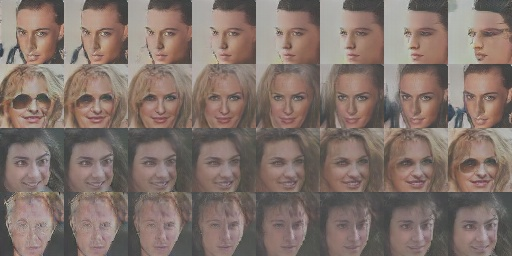

# DCGAN with Tensorflow Estimator
- [DCGAN](http://arxiv.org/abs/1511.06434)
- [Tensorflow Estimator](https://www.tensorflow.org/programmers_guide/estimators)

## Tested with...
- Python 3.5
- Tensorflow 1.4.1

## Results
### After 1 epoch

### After 20 epoch

## Code references
- [Tensorflow implementation of DCGAN](https://github.com/sugyan/tf-dcgan)
  + Generator and discriminator code
- [DCGAN in Tensorflow](https://github.com/carpedm20/DCGAN-tensorflow)
  + Download script
